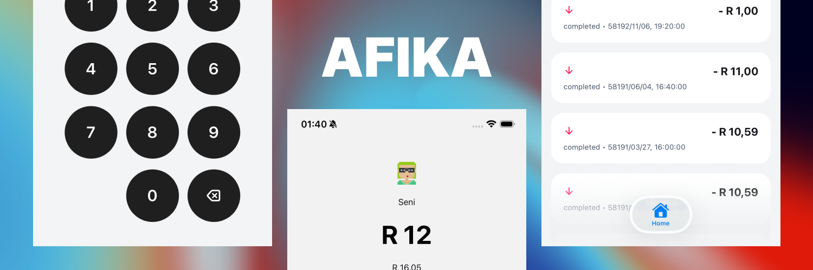

# Afika

AFIKA is a non-custodial mobile wallet: a Go EOA core (via `gomobile`), an Expo app, and a lightweight backend API that caches balances, transactions, and FX rates.

## Monorepo map

- `core/`: Go wallet core + backend API (`core/cmd/api`) + CLI
- `app/`: Expo app + native bridge module (`modules/pocket-module`) for `WalletCore`
- `docs/`: technical docs, implementation notes, and task lists
- `doc/`: product, business, and marketing notes

## MVP v1: EOA Wallet

**On-device (Go core via gomobile):**
- Generates and stores a single EOA per user in SQLCipher.
- Secure init path (`initWalletSecure`) pulls key material from Keychain/Keystore.
- ETH + USDC balances, sends, and transaction history.
- Watch list for inbound monitoring and encrypted backup export/import.

**Backend (optional, non-custodial):**
- Caches balances, transactions, and FX rates for faster UI and analytics.
- No user private keys; does not sign transactions.
- See `docs/backend.md` for endpoints and worker behavior.

**App:**
- Default network is `ethereum-sepolia` in development and `ethereum-mainnet` in production.
- Registers the active network + USDC token at startup.
- Uses biometrics/PIN gating for sends.

## Network defaults

- App default network: `ethereum-sepolia` (dev) / `ethereum-mainnet` (prod).
- Default token scope in app: `native` and `usdc`.

## Core API surface (bridge-facing)

The Expo bridge exposes the `WalletCore` facade. For the full method list see:
- `app/modules/pocket-module/README.md`

Key capabilities include:
- wallet lifecycle + secure init
- network/token registration
- balances, transfers, and transaction history
- watched addresses and backup export/import

## Validation commands

### Contracts (future phase)

```bash
cd contract
npx hardhat test
```

### Go core

```bash
cd core
go test ./...
```

### Expo app TypeScript

```bash
cd app
npm run lint
npx tsc --noEmit
```

## More docs

- Backend API: `docs/backend.md`
- Working notes: `docs/notes.md`
- Active task list: `docs/tasks.md`
- Core internals: `core/README.md`
